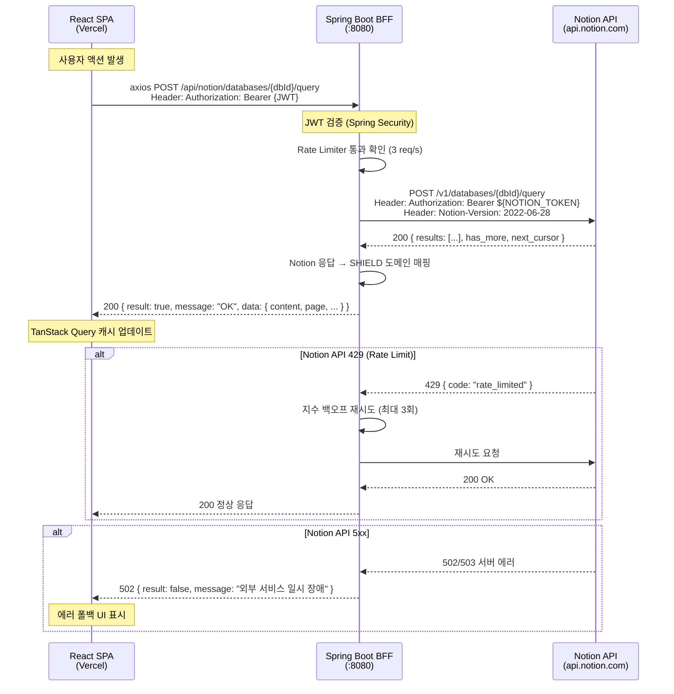

# Notion API 연동 설계 문서

> 작성일: 2026-04-17 · 상태: Draft · 산출물: 개발 계획서 (구현은 다음 단계)

---

## 1. Executive Summary

**가정한 기술 스택 (실제 프로젝트 기준):**

| 항목 | 값 |
|------|-----|
| 프론트엔드 | Vite 8 + React 19 + TypeScript 6 + TanStack Query v5 + axios |
| 백엔드 | Spring Boot (Java) — `:8080` |
| 서비스 인증 | JWT Bearer (access) + HttpOnly Cookie (refresh) |
| 배포 | Vercel SPA (FE), BE 배포 환경 미확정 |
| 멀티테넌시 | 단일 테넌트 (Notion Integration Token 1개) |
| Notion 기능 | Databases(query/create/update), Pages(retrieve/create) |
| Notion DB/Page ID | 환경변수 주입 — `${NOTION_DB_ID}` |

**연동 목적:** SHIELD 법률정보 플랫폼의 사건·변호사·법령 데이터를 Notion Database에서 구조적으로 관리하고, BFF를 통해 React UI에 안전하게 노출한다.

**최종 사용자 가치:** 관리자/변호사가 Notion 워크스페이스에서 편집한 법률 데이터가 SHIELD 플랫폼에 실시간으로 반영되어, 별도 관리 도구 없이 콘텐츠를 운영할 수 있다.

**In Scope:**
- Notion Database 쿼리(필터/정렬/페이지네이션) 및 CRUD
- Notion Page 조회 및 생성
- BFF 에러 정규화 및 Rate Limit 대응
- FE TanStack Query 훅 + 캐싱 전략

**Out of Scope:**
- Notion Blocks API (페이지 본문 블록 렌더링)
- Notion 댓글/토론 기능
- Notion Webhook 실시간 동기화 (확장 단계에서 검토)
- Notion 파일 업로드 (기존 `DocumentsPage` 경로 사용)
- 멀티 워크스페이스 / 멀티 테넌트

---

## 2. 아키텍처 설계

### 2-1. 데이터 흐름 다이어그램



### 2-2. 백엔드 BFF 엔드포인트 스펙

모든 엔드포인트는 `@RestController @RequestMapping("/api/notion")` 하위에 정의한다.
응답은 기존 SHIELD 패턴인 `ApiResponse<T>` 엔벨로프를 따른다.

| 메서드 | 경로 | 요청 DTO (키) | 응답 DTO (키) | 내부 Notion API 호출 |
|--------|------|---------------|---------------|---------------------|
| POST | `/databases/{dbId}/query` | `filter?`, `sorts?`, `startCursor?`, `pageSize?` | `content[]`, `page`, `size`, `totalElements`, `hasNext` | `POST /v1/databases/{dbId}/query` |
| POST | `/databases` | `parentPageId`, `title`, `properties{}` | `databaseId`, `title`, `createdAt` | `POST /v1/databases` |
| PATCH | `/databases/{dbId}` | `title?`, `properties?` | `databaseId`, `title`, `updatedAt` | `PATCH /v1/databases/{dbId}` |
| GET | `/pages/{pageId}` | — | `pageId`, `properties{}`, `createdAt`, `updatedAt` | `GET /v1/pages/{pageId}` |
| POST | `/pages` | `parentDatabaseId`, `properties{}` | `pageId`, `properties{}`, `createdAt` | `POST /v1/pages` |
| PATCH | `/pages/{pageId}` | `properties?`, `archived?` | `pageId`, `properties{}`, `updatedAt` | `PATCH /v1/pages/{pageId}` |

**인증 흐름:**
- FE → BFF: 기존 axios 인터셉터가 `Authorization: Bearer {JWT}` 자동 주입
- BFF → Notion: Spring Boot가 `${NOTION_TOKEN}`을 서버 사이드에서 주입. FE에 절대 노출 안 됨

### 2-3. 에러 정규화 정책

Spring Boot `@ControllerAdvice`에서 Notion API 에러를 `ApiResponse<null>` 형태로 정규화한다.

| Notion 상태 | Notion 에러 코드 | 우리 HTTP 상태 | 우리 message | 비고 |
|-------------|-----------------|---------------|-------------|------|
| 400 | `validation_error` | 400 | `"요청 파라미터가 올바르지 않습니다"` | 필터/속성 타입 불일치 등 |
| 401 | `unauthorized` | 502 | `"외부 서비스 인증 오류"` | 토큰 만료/무효 → 운영팀 알림 |
| 403 | `restricted_resource` | 403 | `"접근 권한이 없는 리소스입니다"` | Integration 권한 부족 |
| 404 | `object_not_found` | 404 | `"요청한 리소스를 찾을 수 없습니다"` | DB/Page ID 불일치 |
| 409 | `conflict_error` | 409 | `"리소스 충돌이 발생했습니다"` | 동시 수정 |
| 429 | `rate_limited` | — | (재시도 후 성공 시 정상 응답) | 재시도 소진 시 → 429 `"요청이 너무 많습니다. 잠시 후 다시 시도해주세요"` |
| 500 | `internal_server_error` | 502 | `"외부 서비스에 일시적 오류가 발생했습니다"` | Notion 내부 장애 |
| 502/503 | — | 502 | `"외부 서비스에 일시적 오류가 발생했습니다"` | Notion 인프라 장애 |
| Timeout | — | 504 | `"외부 서비스 응답 시간이 초과되었습니다"` | 30s timeout |

**설계 원칙:** Notion의 원시 에러 body는 FE에 전달하지 않는다. 사용자에게는 항상 한국어 메시지만 노출.

### 2-4. Rate Limit 대응

Notion API 제한: **평균 3 requests/second** (버스트 허용 없음).

**서버 사이드 (Spring Boot):**

| 파라미터 | 권고값 | 근거 |
|---------|--------|------|
| Rate Limiter 허용량 | 3 req/s | Notion 공식 제한 |
| 초기 재시도 딜레이 | 1,000ms | Notion 권장 |
| 백오프 배수 | 2x | 지수 백오프 |
| 최대 재시도 횟수 | 3회 | 최대 대기 = 1s + 2s + 4s = 7s |
| 최대 대기 시간 | 8,000ms | 7s 백오프 + 1s 마진 |

구현: Resilience4j `RateLimiter` + `Retry` 조합

```
// 의사코드: 설정 키만 열거
RateLimiterConfig:
  limitForPeriod: 3
  limitRefreshPeriod: 1s
  timeoutDuration: 5s

RetryConfig:
  maxAttempts: 3
  waitDuration: 1000ms
  retryOnResult: response.statusCode == 429
  intervalFunction: IntervalFunction.ofExponentialBackoff(1000, 2)
```

**클라이언트 사이드 (FE):**
- TanStack Query `retry: 1` (기존 글로벌 설정) 유지
- BFF가 Rate Limit을 흡수하므로 FE에서 추가 대응 불필요
- 429가 FE까지 도달한 경우: 에러 토스트 "잠시 후 다시 시도해주세요"

### 2-5. 캐싱 전략

**읽기:쓰기 비율 가정:** 8:2 (대부분 조회, 간헐적 생성/수정)

**권고안: Spring Cache (Caffeine) — 서버 사이드 인메모리 캐시**

| 선택지 | 장점 | 단점 | 적합도 |
|--------|------|------|--------|
| Redis | 분산 캐시, TTL 정밀 제어, 서버 간 공유 | 인프라 추가, 단일 서버에선 오버스펙 | 확장 단계 |
| Caffeine (인메모리) | 의존성 최소, 빠름, Spring Cache와 네이티브 통합 | 서버 재시작 시 소멸, 멀티 인스턴스 비공유 | **MVP 권고** |
| 캐시 없음 | 구현 단순 | Rate Limit 소진 빠름, 응답 지연 | 비권고 |

**Caffeine 캐시 정책:**

| 캐시 이름 | 대상 | TTL | 최대 크기 | 무효화 시점 |
|-----------|------|-----|----------|------------|
| `notion-db-schema` | DB 속성 스키마 | 5min | 50 | DB 수정 시 |
| `notion-db-query` | DB 쿼리 결과 | 30s | 200 | 같은 DB에 페이지 생성/수정 시 |
| `notion-page` | 페이지 상세 | 1min | 500 | 해당 페이지 수정 시 |

**FE 캐싱:**
- TanStack Query `staleTime` 기본값 5분 → Notion 훅에서 30초로 오버라이드 권고
- `gcTime` (기본 5분) 유지

---

## 3. 데이터 모델

### 3-1. Notion 속성 타입 → SHIELD 도메인 필드 매핑

**사건/상담 데이터베이스:**

| Notion 속성명 | Notion 타입 | SHIELD 필드명 | TypeScript 타입 | 변환 방식 |
|--------------|-------------|--------------|----------------|----------|
| 제목 | `title` | `title` | `string` | `title[0].plain_text` |
| 법률 분야 | `select` | `domain` | `DomainType` | `select.name` → enum 매핑 |
| 상태 | `status` | `status` | `string` | `status.name` |
| 키워드 | `multi_select` | `keywords` | `string[]` | `multi_select.map(s => s.name)` |
| 핵심 쟁점 | `rich_text` | `keyIssues` | `string` | `rich_text.map(r => r.plain_text).join('')` |
| 담당 변호사 | `relation` | `lawyerIds` | `string[]` | `relation.map(r => r.id)` |
| 생성일 | `created_time` | `createdAt` | `string` (ISO) | 그대로 전달 |
| 최종 수정일 | `last_edited_time` | `updatedAt` | `string` (ISO) | 그대로 전달 |
| 우선순위 | `number` | `priority` | `number` | `number` 그대로 |
| 마감일 | `date` | `dueDate` | `string \| null` | `date.start` (ISO 날짜) |

**변호사 데이터베이스:**

| Notion 속성명 | Notion 타입 | SHIELD 필드명 | TypeScript 타입 | 변환 방식 |
|--------------|-------------|--------------|----------------|----------|
| 이름 | `title` | `name` | `string` | `title[0].plain_text` |
| 전문분야 | `multi_select` | `specializations` | `string[]` | `multi_select.map(s => s.name)` |
| 경력(년) | `number` | `experienceYears` | `number` | `number` 그대로 |
| 지역 | `select` | `region` | `string` | `select.name` |
| 상태 | `select` | `verificationStatus` | `VerificationStatus` | `select.name` → enum 매핑 |
| 이메일 | `email` | `email` | `string` | `email` 그대로 |
| 연락처 | `phone_number` | `phone` | `string` | `phone_number` 그대로 |

### 3-2. 복합 타입 단순화 규칙

| Notion 타입 | 단순화 방식 | 예시 |
|-------------|-----------|------|
| `title` | 첫 번째 블록의 `plain_text` 추출 | `title[0].plain_text` → `"민사 분쟁 사건"` |
| `rich_text` | 모든 블록의 `plain_text` 연결 | `.map(r => r.plain_text).join('')` |
| `select` | `name` 필드만 추출 | `select.name` → `"CIVIL"` |
| `multi_select` | `name` 배열로 변환 | `.map(s => s.name)` → `["민사", "계약"]` |
| `relation` | ID 배열로 변환 | `.map(r => r.id)` → `["uuid1", "uuid2"]` |
| `date` | `start` 필드만 추출 (ISO string) | `date.start` → `"2026-04-17"` |
| `number` | 그대로 전달 | `number` → `5` |
| `checkbox` | 그대로 전달 | `checkbox` → `true` |
| `email` | 그대로 전달 | `email` → `"lawyer@example.com"` |
| `phone_number` | 그대로 전달 | `phone_number` → `"010-1234-5678"` |
| `url` | 그대로 전달 | `url` → `"https://..."` |
| `formula` | `formula.string \| .number \| .boolean` | 타입에 따라 분기 |
| `rollup` | `rollup.array → 재귀 단순화` | 내부 타입에 따라 처리 |
| `files` | URL 배열로 변환 | `.map(f => f.file?.url \|\| f.external?.url)` |

**역방향 (SHIELD → Notion 생성/수정 시):**

Spring Boot `NotionService`에서 SHIELD 도메인 필드를 Notion 속성 JSON 구조로 변환한다.

```
// 의사코드: 변환 매핑 키
"title"        → { title: [{ text: { content: value } }] }
"rich_text"    → { rich_text: [{ text: { content: value } }] }
"select"       → { select: { name: value } }
"multi_select" → { multi_select: values.map(v => ({ name: v })) }
"number"       → { number: value }
"date"         → { date: { start: value } }
"checkbox"     → { checkbox: value }
"relation"     → { relation: ids.map(id => ({ id })) }
```

---

## 4. 구현 태스크 분해 (WBS)

| ID | 트랙 | 작업 내용 | 선행 태스크 | 예상(hr) | 담당 |
|----|------|----------|-----------|---------|------|
| BE-01 | BE | `application.yml`에 `notion.token`, `notion.version`, `notion.base-url` 환경변수 구조 정의 | — | 1 | BE |
| BE-02 | BE | `NotionProperties` `@ConfigurationProperties` 클래스 생성 | BE-01 | 1 | BE |
| BE-03 | BE | `NotionClient` — WebClient 인스턴스 생성, Notion REST API 6개 메서드 래핑 | BE-02 | 4 | BE |
| BE-04 | BE | Resilience4j `RateLimiter` + `Retry` 설정 (3 req/s, 지수 백오프) | BE-03 | 2 | BE |
| BE-05 | BE | `NotionPropertyMapper` — Notion JSON ↔ SHIELD 도메인 양방향 변환 | BE-02 | 4 | BE |
| BE-06 | BE | `NotionService` — 비즈니스 로직 (쿼리 파라미터 조합, 페이지네이션 매핑, 캐시 무효화) | BE-03, BE-05 | 4 | BE |
| BE-07 | BE | `NotionController` — 6개 엔드포인트 + 입력 검증 (`@Valid`) | BE-06 | 3 | BE |
| BE-08 | BE | 에러 정규화 `@ControllerAdvice` — Notion 에러 → `ApiResponse` 매핑 | BE-07 | 2 | BE |
| BE-09 | BE | Spring Cache (Caffeine) 설정 — 3개 캐시 존 (db-schema, db-query, page) | BE-06 | 2 | BE |
| BE-10 | BE | 로깅·관측 — Notion API 호출 시간/상태/에러율 메트릭 (Micrometer) | BE-04 | 2 | BE |
| BE-11 | BE | 단위 테스트 — `NotionClientTest` (MockWebServer), `NotionServiceTest` (Mockito) | BE-06 | 4 | BE |
| BE-12 | BE | 통합 테스트 — `NotionControllerTest` (`@WebMvcTest`), WireMock E2E | BE-07, BE-08 | 4 | BE |
| FE-01 | FE | `src/types/notion.ts` — Notion 도메인 타입 정의 (NotionEntry, NotionPage, NotionFilter 등) | C-01 | 2 | FE |
| FE-02 | FE | `src/lib/notionApi.ts` — API 모듈 (기존 `consultationApi.ts` 패턴 복제) | FE-01 | 2 | FE |
| FE-03 | FE | `src/hooks/useNotion.ts` — TanStack Query 훅 (KEYS 팩토리, useQuery/useMutation) | FE-02 | 3 | FE |
| FE-04 | FE | Notion 데이터 뷰 페이지 — 목록 (테이블/카드), 상세, 생성/수정 폼 | FE-03 | 8 | FE |
| FE-05 | FE | `src/App.tsx` 라우트 등록 — `lazy()` import + 역할별 가드 | FE-04 | 1 | FE |
| FE-06 | FE | 로딩·에러·빈 상태 UI — Skeleton, 에러 메시지, empty state | FE-04 | 2 | FE |
| FE-07 | FE | 낙관적 업데이트 — 생성/수정 mutation에 `onMutate`/`onSettled` 적용 | FE-03 | 2 | FE |
| FE-08 | FE | MSW 핸들러 + 훅 테스트 (`useNotion.test.ts`) | FE-03 | 3 | FE |
| FE-09 | FE | 컴포넌트 테스트 (Notion 뷰 페이지) | FE-04 | 3 | FE |
| C-01 | 공통 | BE ↔ FE 엔드포인트 계약 정의 (DTO 키, 상태 코드, 에러 형식) | — | 2 | 공통 |
| C-02 | 공통 | MSW 세팅 (`pnpm add -D msw`) + `src/test/setup.ts` 확장 | — | 1 | FE |
| C-03 | 공통 | CI 파이프라인 — Notion 관련 테스트 포함, 토큰 미노출 검증 스텝 추가 | BE-11, FE-08 | 2 | 공통 |

**총 예상 공수:** BE 33hr + FE 26hr + 공통 5hr = **64hr**

---

## 5. HTTP 클라이언트 설계 (의사코드)

### 5-1. 백엔드 — Notion 호출용 WebClient 인스턴스

Spring Boot에서 Notion REST API를 호출하는 `NotionClient` 내부 WebClient 설정.

```
// 의사코드: 설정 키와 값 열거 (함수 본문 없음)

WebClient 설정:
  baseUrl: "https://api.notion.com/v1"
  defaultHeader:
    Authorization: "Bearer ${NOTION_TOKEN}"    // 환경변수 주입
    Notion-Version: "2022-06-28"               // API 버전 고정
    Content-Type: "application/json"
  timeout:
    connectTimeout: 5_000ms
    readTimeout: 30_000ms
  codecs:
    maxInMemorySize: 2MB                       // 대용량 응답 허용

Resilience4j 데코레이터:
  RateLimiter:
    limitForPeriod: 3
    limitRefreshPeriod: 1s
    timeoutDuration: 5s
  Retry:
    maxAttempts: 3
    waitDuration: 1_000ms
    intervalFunction: exponentialBackoff(initialInterval=1000, multiplier=2.0)
    retryExceptions: [WebClientResponseException(429), ConnectTimeoutException]
    ignoreExceptions: [WebClientResponseException(400), WebClientResponseException(404)]
  CircuitBreaker:
    failureRateThreshold: 50
    slowCallDurationThreshold: 10s
    waitDurationInOpenState: 30s
    slidingWindowSize: 10

메서드 시그니처 (타입만):
  queryDatabase(databaseId: String, request: NotionQueryRequest): Mono<NotionQueryResponse>
  retrievePage(pageId: String): Mono<NotionPageResponse>
  createPage(request: NotionCreatePageRequest): Mono<NotionPageResponse>
  updatePage(pageId: String, request: NotionUpdatePageRequest): Mono<NotionPageResponse>
  createDatabase(request: NotionCreateDatabaseRequest): Mono<NotionDatabaseResponse>
  updateDatabase(databaseId: String, request: NotionUpdateDatabaseRequest): Mono<NotionDatabaseResponse>
```

### 5-2. 프론트엔드 — 우리 백엔드 호출용 인스턴스

**기존 `src/lib/api.ts` 그대로 재사용** (CLAUDE.md 규칙: "새 axios 인스턴스 금지").

```
// 기존 api.ts 설정 (변경 없음):
  baseURL: "${VITE_API_URL}/api"     // 프록시: /api → localhost:8080
  timeout: 30_000ms
  headers: { Content-Type: "application/json" }
  requestInterceptor: Authorization: Bearer {JWT} 자동 주입
  responseInterceptor:
    401 → POST /api/auth/token/refresh (withCredentials: true)
         → 새 accessToken으로 원래 요청 재시도
         → refresh 실패 시 → clearTokens() + redirect /login
```

**신규 `src/lib/notionApi.ts` 구조** (`consultationApi.ts` 패턴 복제):

```
// 의사코드: 타입 시그니처만

const BASE = '/notion'

notionApi.queryDatabase(dbId: string, params?: NotionQueryParams)
  → api.post<ApiResponse<PageResponse<NotionEntry>>>(`${BASE}/databases/${dbId}/query`, params)

notionApi.createDatabase(data: CreateDatabaseRequest)
  → api.post<ApiResponse<NotionDatabase>>(`${BASE}/databases`, data)

notionApi.updateDatabase(dbId: string, data: UpdateDatabaseRequest)
  → api.patch<ApiResponse<NotionDatabase>>(`${BASE}/databases/${dbId}`, data)

notionApi.getPage(pageId: string)
  → api.get<ApiResponse<NotionPage>>(`${BASE}/pages/${pageId}`)

notionApi.createPage(data: CreatePageRequest)
  → api.post<ApiResponse<NotionPage>>(`${BASE}/pages`, data)

notionApi.updatePage(pageId: string, data: UpdatePageRequest)
  → api.patch<ApiResponse<NotionPage>>(`${BASE}/pages/${pageId}`, data)
```

**TanStack Query KEYS 팩토리** (`useConsultation.ts` 패턴 복제):

```
// 의사코드: 키 구조만

const KEYS = {
  all:             ['notion'] as const
  databases:       () => [...KEYS.all, 'databases'] as const
  databaseEntries: (dbId: string) => [...KEYS.all, 'entries', dbId] as const
  pages:           () => [...KEYS.all, 'pages'] as const
  page:            (pageId: string) => [...KEYS.all, 'page', pageId] as const
}
```

---

## 6. 테스트 전략

| 레벨 | 대상 | 도구 | 커버리지 목표 |
|------|------|------|-------------|
| 단위 | BE `NotionClient` | JUnit 5 + MockWebServer (OkHttp) | ≥ 80% |
| 단위 | BE `NotionService` | JUnit 5 + Mockito | ≥ 80% |
| 단위 | BE `NotionPropertyMapper` | JUnit 5 (순수 함수) | ≥ 90% |
| 통합 | BE `NotionController` | `@WebMvcTest` + MockMvc | 6개 엔드포인트 전수 |
| 통합 | BE 전체 BFF 흐름 | `@SpringBootTest` + WireMock | 주요 시나리오 5개+ |
| 단위 | FE `notionApi.ts` | Vitest + MSW `setupServer` | ≥ 80% |
| 단위 | FE `useNotion.ts` 훅 | Vitest + `renderHook` + MSW | ≥ 70% |
| 컴포넌트 | FE Notion 뷰 페이지 | Vitest + Testing Library + MSW | ≥ 70% |
| E2E | 핵심 시나리오 3개 | Playwright | 아래 참조 |

### E2E 시나리오

1. **Notion DB 조회 → 화면 렌더링:**
   로그인 → Notion 데이터 목록 페이지 접근 → 테이블/카드에 데이터 렌더링 확인 → 페이지네이션 동작

2. **항목 생성 → 낙관적 업데이트 → 서버 확인:**
   생성 폼 입력 → 제출 → 목록에 낙관적으로 추가됨 → 새로고침 후에도 존재 확인

3. **Notion API 5xx → 에러 폴백 UI:**
   (WireMock으로 502 주입) → 에러 메시지 UI 표시 → 재시도 버튼 동작 확인

### FE 테스트 세팅 추가사항

MSW가 현재 `package.json`에 없음. 설치 필요:

```
devDependency 추가: msw (^2.x)
```

`src/test/setup.ts` 확장:

```
// 의사코드: 설정 키만
beforeAll: server.listen({ onUnhandledRequest: 'error' })
afterEach: server.resetHandlers()
afterAll: server.close()
```

---

## 7. 리스크 및 완화책

| 리스크 | 발생 조건 | 영향도 | 완화책 |
|--------|----------|--------|--------|
| **Notion API Rate Limit 초과** | 동시 사용자 다수 + 캐시 미스 집중 | 상 | Resilience4j RateLimiter(3 req/s) + 지수 백오프 3회 재시도 + 캐시 TTL로 호출량 감소 |
| **Notion API 버전 변경** | Notion이 `2022-06-28` 이후 breaking change 배포 | 중 | `Notion-Version` 헤더 고정 + 분기별 릴리즈 노트 검토 + 통합 테스트에서 응답 스키마 검증 |
| **토큰 유출** | 로그에 토큰 출력, 설정 파일 커밋, FE 번들 포함 | 상 | (1) 토큰은 환경변수만 사용 (2) 빌드 산출물에 `NOTION` 문자열 포함 여부 정적 분석 (3) 유출 감지 시: Notion 대시보드에서 즉시 revoke → 새 토큰 발급 → 접근 로그 감사 |
| **Notion 서비스 장애** | Notion 인프라 다운 (502/503) | 상 | CircuitBreaker(failureRate 50% → open 30s) + FE에서 "서비스 일시 이용 불가" 폴백 UI + 마지막 캐시 데이터 표시 (stale-while-revalidate) |
| **대용량 DB 쿼리 지연** | 1만건+ 데이터베이스 전체 조회 | 중 | Notion 커서 기반 페이지네이션(100건 단위) + BFF에서 `PageResponse` 변환 + FE 무한 스크롤 |
| **Notion 속성 스키마 불일치** | 관리자가 Notion에서 속성명/타입 변경 | 중 | BE `NotionPropertyMapper`에서 unknown 속성 graceful skip + 모니터링 알림 |
| **멀티 인스턴스 캐시 불일치** | BE 서버 2대+ 운영 시 Caffeine 로컬 캐시 분산 | 하 | MVP에서는 단일 인스턴스 가정. 스케일아웃 시 Redis로 마이그레이션 (확장 단계) |

---

## 8. 일정

### 마일스톤

| 단계 | 기간 | 포함 범위 | Critical Path |
|------|------|----------|---------------|
| **MVP** | 2주 | BE: NotionClient + NotionService + 읽기 전용 엔드포인트 (query, getPage) + 에러 정규화<br/>FE: `notionApi.ts` + `useNotion.ts` (읽기 훅) + 목록/상세 페이지<br/>공통: DTO 계약 정의 | BE-01 → BE-03 → BE-05 → BE-06 → BE-07 |
| **v1** | +2주 (누적 4주) | BE: 생성/수정 엔드포인트 + Caffeine 캐싱 + Rate Limiter + 단위/통합 테스트<br/>FE: 생성/수정 mutation + 낙관적 업데이트 + MSW 테스트 + 에러/빈상태 UI<br/>공통: CI 파이프라인 + 토큰 미노출 검증 | FE-07 (낙관적 업데이트는 BE CRUD 완성 후) |
| **확장** | +2주~ (누적 6주+) | Notion Webhook 수신 → 실시간 동기화<br/>다중 DB 검색<br/>Notion Blocks → 리치텍스트 렌더링<br/>Redis 캐시 마이그레이션 (멀티 인스턴스 대응) | Webhook은 BE public URL 필요 (배포 환경 확정 후) |

### Critical Path 상세

```
BE-01 (env) → BE-02 (config) → BE-03 (client) → BE-05 (mapper) → BE-06 (service) → BE-07 (controller)
                                                                                          ↓
                                                                               FE-01 (types) → FE-02 (api) → FE-03 (hooks) → FE-04 (pages)
```

BE-07 완료가 FE-01 시작의 선행 조건. **BE-03~BE-06이 전체 일정의 병목**.
다만 C-01(DTO 계약)을 먼저 확정하면 FE-01~FE-03은 MSW 모킹으로 BE와 병렬 개발 가능.

---

## 9. 완료 정의 (Definition of Done)

- [ ] BE 각 엔드포인트 단위 테스트 커버리지 ≥ 80%
- [ ] FE 훅 + API 모듈 테스트 커버리지 ≥ 70%
- [ ] 빌드 산출물(FE 번들 + BE jar)에 Notion 토큰이 포함되지 않음을 정적 분석으로 검증
  - FE: `grep -r "NOTION" dist/` 결과 0건
  - BE: `jar tf app.jar | xargs grep "ntn_"` 결과 0건
- [ ] BE README에 로컬 개발 환경 설정 가이드 작성 (환경변수, Notion Integration 생성 절차)
- [ ] FE `docs/notion-integration.md` (이 문서)가 최신 상태로 유지
- [ ] 에러율·Notion 호출 지연 모니터링 대시보드 존재 (Micrometer → Prometheus/Grafana 또는 동등)
- [ ] Rate Limiter가 3 req/s를 초과하지 않음을 부하 테스트로 검증
- [ ] 모든 Notion 에러 시나리오(400/401/404/429/500/502/timeout)에 대해 FE에서 한국어 에러 메시지 표시
- [ ] `pnpm build` (FE) 타입 에러 0건
- [ ] E2E 시나리오 3개 Playwright 통과
- [ ] 코드 리뷰 완료 + develop 브랜치 머지

---

## 10. 오픈 퀘스천

| # | 질문 | 왜 이 결정이 필요한가 |
|---|------|---------------------|
| 1 | **사용할 Notion Database ID는?** | BFF 엔드포인트의 환경변수 키 구조와 접근 범위가 달라진다. 단일 DB vs 다중 DB에 따라 라우팅 설계가 변경됨. |
| 2 | **접근 권한 범위: ADMIN 전용인가, LAWYER/USER에게도 노출하는가?** | `App.tsx` 라우트 가드 (`RoleRoute`) 설정과 BE `@PreAuthorize` 범위가 달라진다. |
| 3 | **읽기/쓰기 비율은?** | 현재 8:2로 가정했으나, 실제 비율에 따라 캐싱 TTL과 Rate Limiter 예산 배분이 변경된다. |
| 4 | **Notion 데이터를 Spring Boot DB에 동기화할 것인가, 순수 프록시(BFF) 방식인가?** | 동기화 시 지연 시간 감소 + Notion 장애 내성 증가, 대신 데이터 정합성 관리 복잡도 증가. MVP에서 결정 필요. |
| 5 | **Notion 페이지 본문(Blocks)을 렌더링할 필요가 있는가?** | 현재 Out of Scope이나, 필요 시 Blocks API 추가 + 리치텍스트 렌더러 컴포넌트 구현이 필요하므로 공수가 크게 증가. |
| 6 | **Spring Boot 서버의 public URL이 확보되는가?** | Notion Webhook은 공개 URL로 POST 요청을 보내므로, 배포 환경에 따라 확장 단계 Webhook 연동 가능 여부가 결정됨. |
| 7 | **Notion Integration의 권한 범위는?** | "Read content" / "Insert content" / "Update content" 중 어디까지 허용하느냐에 따라 BFF 엔드포인트 범위가 달라진다. |
