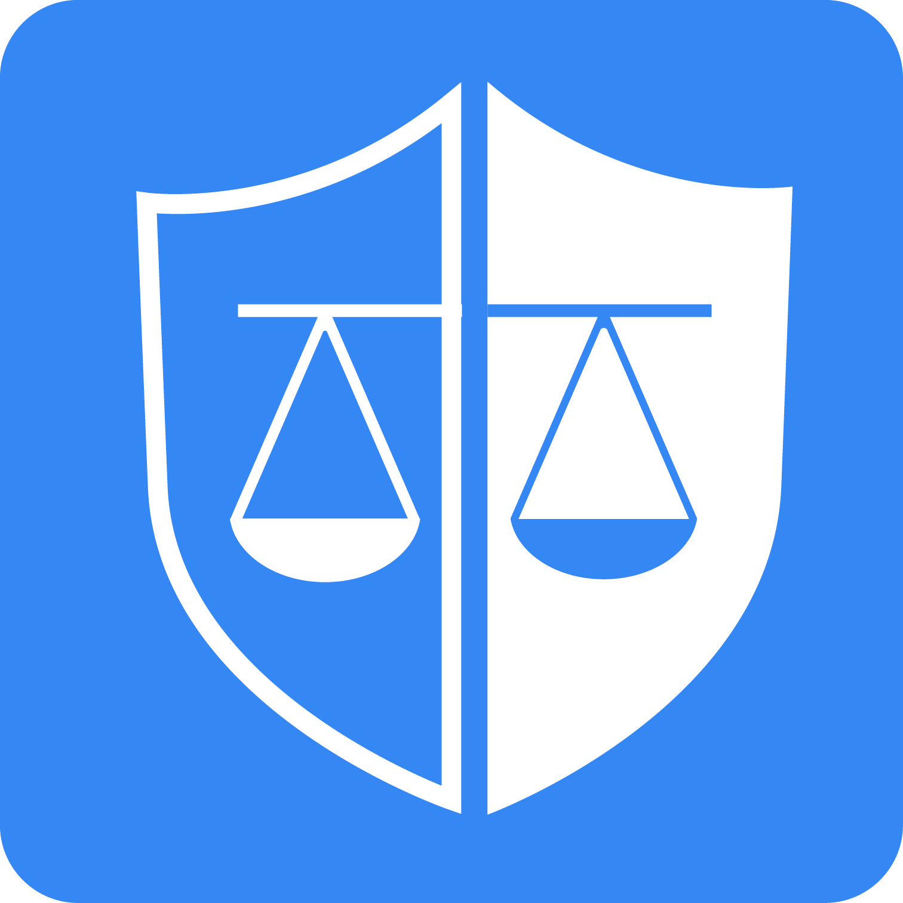
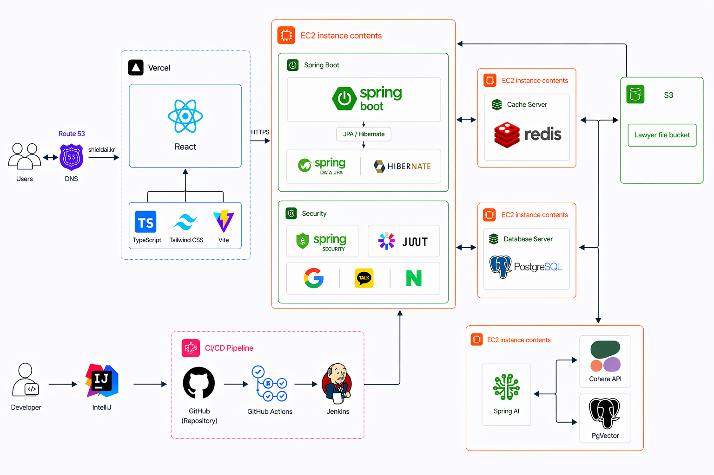

<h1 align="center">
  
  SHIELD
</h1>
<h3 align="center">AI 가 함께 정리해주는, 변호사 상담 전 의뢰서 생성 서비스</h3>

  

  <i>국민대학교 소프트웨어학부 캡스톤디자인 2026 — 27조</i>

---

## 이런 경험, 한 번쯤 있으시지 않나요?

> "변호사한테 가긴 가야 할 것 같은데... 내가 겪은 일이 정확히 뭐 때문에 일어난 건지도 모르겠어요."

> "상담료가 1시간에 11만원인데, 막상 갔더니 30분 동안 상황 설명하다 다 끝났어요."

> "이게 임대차 문제인 줄 알았는데, 알고 보니 부동산 계약 문제였대요."

법률 상담은 **비싸고 짧습니다**. 그런데 일반인은 자기 상황이 어떤 법률 분야에 속하는지조차 알기 어렵습니다. 정리되지 않은 채로 변호사 앞에 앉으면, 결국 한 번의 상담은 "상황 설명하다 끝난 시간" 이 되곤 합니다.

---

## SHIELD 가 해결합니다

**SHIELD** 는 변호사를 만나기 **전 단계** 를 도와드립니다.

1. **채팅하듯 상황을 말씀해주세요** — "집주인이 보증금을 안 돌려줘서..." 같이 일상 언어로 OK
2. **AI 가 관련 법령·판례를 검색하며 후속 질문** — 빠뜨리기 쉬운 사실관계까지 자연스럽게 끌어냅니다
3. **자동으로 의뢰서 생성** — 분야 자동 분류 + 핵심 쟁점 정리
4. **분야 전문 변호사에게 전송** — 변호사가 수락하면 본격 상담으로 연결

상담실에 들어갈 때, 당신의 사건은 이미 **정리되어 있습니다**.

---

## 핵심 차별점

### 1. RAG 기반 — 일반 챗봇과 다릅니다

대부분의 법률 챗봇은 사전 학습된 일반 지식에만 의존합니다. SHIELD 는 매 질문마다 **한국법제연구원(KLRI) 법률 온톨로지** 위에서 관련 법령·판례를 실시간 검색해 답변에 반영합니다.

- 1,193개 민법 조문 + 대법원 판례 임베딩
- 벡터 + 키워드 + 유사도 3-way 하이브리드 검색
- 검색 실패 시에도 자연스럽게 동작하도록 자동 fallback

### 2. 8개 분야 자동 분류

부동산 거래 · 이혼·위자료·재산분할 · 상속·유류분·유언 · 근로계약·해고·임금 · 손해배상·불법행위 · 채무·보증·개인파산·회생 · 임대차보호 · 기업·상사거래

사용자가 분야를 몰라도 됩니다. 대화 중에 AI 가 자동으로 분류해드립니다.

### 3. 변호사 매칭 워크플로

생성된 의뢰서는 분야별 **인증된 변호사** 에게 전송됩니다. 변호사는 24시간 안에 수락 또는 거절을 결정하고, 수락 시 사건이 본격적으로 시작됩니다.

---

## 누가 사용하나요?

<table>
  <tr>
    <th width="33%" align="center">의뢰인</th>
    <th width="33%" align="center">변호사</th>
    <th width="33%" align="center">관리자</th>
  </tr>
  <tr>
    <td valign="top">
      AI 와 대화하며 사건 정리 
      자동 생성된 의뢰서를 변호사에게 송부 
      진행률 시각화, 분야 재선택 가능
    </td>
    <td valign="top">
      분야별 매칭된 의뢰서 인박스 수신 
      24시간 안에 수락 / 거절 결정 
      진행 사건 목록·상세 조회
    </td>
    <td valign="top">
      변호사 자격 서류 심사·승인 
      24시간 미처리 의뢰 알림 확인 
      운영 통계·대시보드 관리
    </td>
  </tr>
</table>

---

## 시스템 구조

  

---

## 팀원 소개

<table>
  <tr>
    <td align="center" width="200" height="200">
       
      <b>이총명</b> 
      FE / AI 
      <a href="https://github.com/intelligent04">@intelligent04</a>
    </td>
    <td align="center" width="200" height="200">
       
      <b>이승진</b> 
      BE / PM 
      <a href="https://github.com/luckyisjelly">@luckyisjelly</a>
    </td>
    <td align="center" width="200" height="200">
       
      <b>강문경</b> 
      FE / BE 
      <a href="https://github.com/chyopriushy">@chyopriushy</a>
    </td>
  </tr>
</table>

---

## 더 알아보기

<table>
  <tr>
    <td>
      <b>지금 체험하기</b> 
      <a href="https://shieldai.kr">https://shieldai.kr</a>
    </td>
    <td>
      <b>개발 문서·소스</b> 
      <a href="https://github.com/kookmin-sw/2026-capstone-27">GitHub Repository</a>
    </td>
  </tr>
  <tr>
    <td>
      <b>Frontend 레포</b> 
      <a href="https://github.com/capstoneSHIELD/SHIELD_FE">SHIELD_FE</a>
    </td>
    <td>
      <b>Backend 레포</b> 
      <a href="https://github.com/capstoneSHIELD/SHIELD_BE">SHIELD_BE</a>
    </td>
  </tr>
</table>